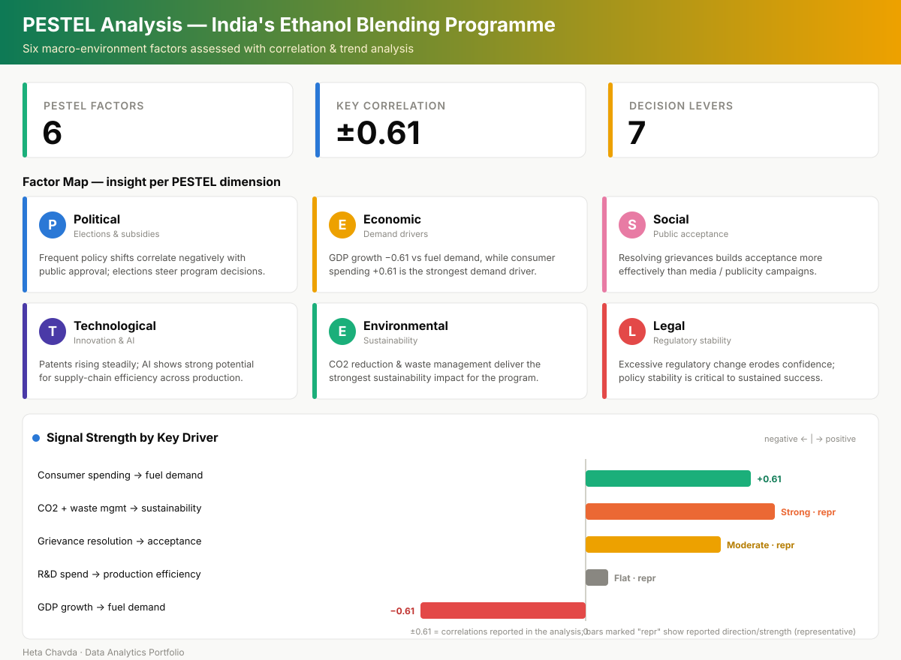

<div align="center">



# 🌱⛽ PESTEL Analysis of India's Ethanol Blending Programme
### A Data-Driven Macro-Environment Case Study — Excel, Correlation & Trend Analysis


</div>

---

## 📌 Project at a Glance

| | |
|---|---|
| **🎯 Goal** | Assess India's Ethanol Blending Programme (EBP) across all six PESTEL dimensions |
| **🧠 Approach** | Correlation heatmaps, scatter/bar/line charts and trend analysis over a compiled dataset |
| **📊 Data** | `Ethanol_PESTEL_Data` — quantitative indicators spanning political, economic, social, technological, environmental & legal variables |
| **📈 Delivery** | Final report (PDF) + presentation deck, supported by Excel analysis |

---

## 🧩 Business Problem / Context

India's Ethanol Blending Programme aims to blend ethanol into petrol to cut oil-import dependence, reduce emissions, and support the farm economy. But a national fuel policy succeeds or fails on many fronts at once.

> **The question:** *Which macro-environment forces most strongly shape the programme's outcomes — and where should policy effort be concentrated?*

A **PESTEL** lens turns a broad policy debate into six structured, evidence-backed dimensions, so recommendations rest on observed relationships rather than opinion.

---

## 🗂️ Scope / Data

| Dimension | What was examined |
|---|---|
| 🔵 **Political** | Elections, government subsidies, policy-change frequency vs public approval |
| 🟡 **Economic** | GDP growth, consumer spending, oil-import cost vs fuel demand |
| 🌸 **Social** | Consumer acceptance, complaints, media awareness, food-vs-fuel concerns |
| 🟣 **Technological** | Patent trends, R&D investment, AI in supply chains |
| 🟢 **Environmental** | Carbon emissions trends, CO₂ reduction, waste management |
| 🔴 **Legal** | Regulatory stability, transparency, public confidence |

---

## 🔬 Methodology / Framework

```
PESTEL CASE-STUDY WORKFLOW
──────────────────────────────────────────────
1. Compile indicators into Ethanol_PESTEL_Data (Excel)
2. Map each variable to a PESTEL dimension
3. Build correlation heatmaps across variables
4. Chart trends (line / bar / scatter) per factor
5. Read signal strength & direction of each driver
6. Translate findings into policy recommendations
──────────────────────────────────────────────
Factors:  Political · Economic · Social ·
          Technological · Environmental · Legal
```

---

## 📊 PESTEL Insights Dashboard

<div align="center">



*One insight per PESTEL dimension, plus signal-strength of the key drivers. Numeric values (±0.61) are correlations reported in the analysis; bars marked "repr" illustrate the reported direction/strength.*

</div>

---

## 📈 Key Insights

### 🔵 Political
- **Frequent policy changes correlate negatively with public approval**
- Elections shape decisions; government subsidies show only weak economic correlation

### 🟡 Economic
- **Consumer spending (+0.61)** is the strongest driver of fuel demand
- **GDP growth (−0.61)** moves inversely to fuel demand; oil-import cost also matters

### 🌸 Social
- **Resolving grievances builds acceptance more than media awareness**
- Acceptance stays high despite food-vs-fuel concerns

### 🟣 Technological
- Patent activity rises steadily; **AI shows strong potential for supply-chain efficiency**
- R&D investment shows a **flat correlation** with production efficiency — a possible misallocation

### 🟢 Environmental
- Emissions trend downward with periodic spikes
- **CO₂ reduction and waste management** deliver the strongest sustainability gains

### 🔴 Legal
- Excessive regulatory change **erodes public confidence** — policy stability is critical

---

## 💼 Impact / Takeaways

| Priority | Recommendation |
|---|---|
| 🔴 **Policy stability** | Roll out gradual, well-communicated regulatory changes |
| 🟣 **R&D focus** | Reallocate R&D toward supply-chain optimisation and AI integration |
| 🌸 **Trust** | Build robust grievance-redressal systems over publicity campaigns |
| 🟢 **Sustainability** | Strengthen CO₂-reduction and waste-management initiatives |
| 🟡 **Growth** | Leverage GDP and spending patterns to time clean-energy expansion |

---

## 🛠️ Tools & Techniques

| Category | Tools |
|---|---|
| **Analysis** | Microsoft Excel (dataset, charts, correlation) |
| **Methods** | Correlation heatmaps, trend analysis, scatter/bar/line charts |
| **Framework** | PESTEL (Political, Economic, Social, Technological, Environmental, Legal) |
| **Deliverables** | Final report (PDF) + presentation deck |

---

## 📁 Repository Contents

```
PESTEL Ethanol Blending Programme/
├── 📁 assets/
│   ├── 🎨 banner.svg                     # Repository banner
│   └── 📊 dashboard.svg                  # PESTEL dashboard
├── 📁 data/
│   └── 📊 Ethanol_PESTEL_Data (2) (1).xlsx   # Compiled indicators + charts
├── 📁 docs/
│   ├── 📄 Final Report.pdf               # Full PESTEL write-up
│   └── 📄 Final Presentation.pptx        # Summary deck
└── 📝 README.md                          # Project overview
```

---

<div align="center">

**Heta Chavda** — Data Analytics | Business Intelligence | Policy Analysis

*Group case study with Rohit Kumar & Krishna Patel*

[](https://github.com/hetachavda)
[](https://linkedin.com/in/hetachavda)

⭐ *Found this useful? Give it a star!*

</div>
